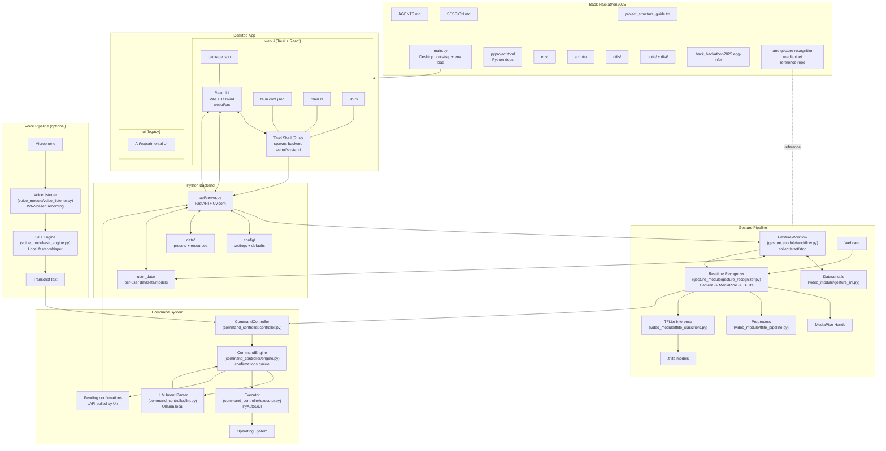

# Back-Hackathon2025

Hand + voice control system with a local gesture ML pipeline, optional voice STT, and a Tauri + React desktop UI. The Python backend exposes a FastAPI server that drives gesture collection/recognition, command mapping, and OS automation through a local LLM (Ollama).

## Project Summary

This project delivers a Windows-first desktop application (macOS supported for local development) that lets users:
- Collect static and dynamic hand gesture samples and store them per user.
- Run real-time gesture recognition using MediaPipe + TFLite classifiers.
- Map gestures (and optionally voice transcripts) to command intents.
- Execute OS actions via PyAutoGUI with confirmation for sensitive commands.
- Manage settings and workflows through a React UI embedded in a Tauri shell.

The system is fully local by default: TFLite runs on-device for gesture inference, and command parsing uses a local LLM (Ollama). Voice recognition uses local-only faster-whisper (no API keys or cloud services required).

## Architecture (Mermaid)

This diagram is maintained in `docs/architecture.mmd` and embedded here for GitHub rendering.

## Tech Stack

- Desktop shell: Tauri (Rust) with a React + Vite UI (TailwindCSS).
- Backend: Python 3.11, FastAPI + Uvicorn.
- Gesture ML: MediaPipe Hands for landmarks, TFLite classifiers for inference.
- Voice STT: local Whisper (faster-whisper).
- Command parsing: Local LLM via Ollama.
- OS automation: PyAutoGUI.

## Core Flows

- Gesture collection: UI -> API -> GestureWorkflow -> CSV datasets in `user_data/<user_id>/`.
- Gesture recognition: UI -> API -> Recognizer -> MediaPipe -> TFLite -> CommandController.
- Voice recognition (optional): VoiceListener -> STT engine -> transcript -> CommandController.
- Command execution: LLM interprets intents -> Executor runs hotkeys, typing, apps, URLs.
- Confirmation loop: Engine queues sensitive commands -> UI polls `/commands/pending`.

## Run (dev)

- Desktop app:
  - `python main.py` (runs `npm run tauri:dev` by default)
  - or `cd webui && npm run tauri:dev`
- API server:
  - `python -m uvicorn api.server:app --reload --host 0.0.0.0 --port 8000`
- Web UI:
  - `cd webui && npm install && npm run dev`

## Environment

Common settings:
- `STT_PROVIDER` = `whisper-local` (only supported option, no cloud/API keys required).
- `LOCAL_WHISPER_MODEL_PATH` = model name or path (default: "small").
- `LOCAL_WHISPER_DEVICE` = "cpu" or "cuda" for GPU acceleration.
- `LOCAL_WHISPER_LANGUAGE` = language code (default: "en").
- `GESTURE_USER_ID` for per-user datasets.
- `ENABLE_VOICE=0` to disable voice features.

Voice pipeline settings (in `config/app_settings.json`):
- `voice_silence_threshold` = audio level threshold for voice detection (default: 0.02).
- `voice_silence_duration_secs` = seconds of silence before stopping recording (default: 1.1).
- `voice_min_record_duration_secs` = minimum recording duration before transcription (default: 0.7).

## Notes

- Windows-first target; macOS is supported for local development.
- Training is handled via notebooks; runtime loads TFLite models from `user_data/<user_id>/`.
- Preset datasets/models are copied from `data/presets/` on startup when missing.

## GitHub Repos Used

- https://github.com/SYSTRAN/faster-whisper
