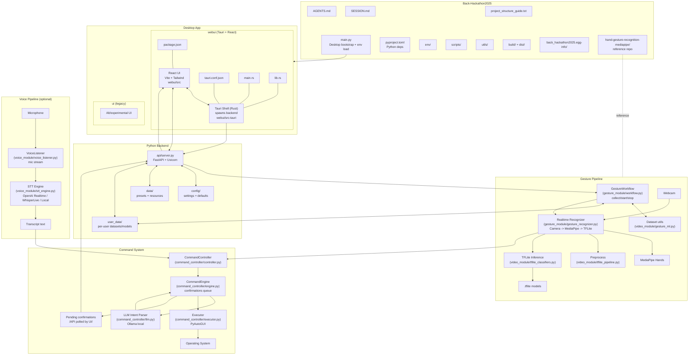

# Back-Hackathon2025

Hand + voice control system with a local gesture ML pipeline, optional voice STT, and a Tauri + React desktop UI. The Python backend exposes a FastAPI server that drives gesture collection/recognition, command mapping, and OS automation through a local LLM (Ollama).

## Project Summary

This project delivers a Windows-first desktop application (macOS supported for local development) that lets users:
- Collect static and dynamic hand gesture samples and store them per user.
- Run real-time gesture recognition using MediaPipe + TFLite classifiers.
- Map gestures (and optionally voice transcripts) to command intents.
- Execute OS actions via PyAutoGUI with confirmation for sensitive commands.
- Manage settings and workflows through a React UI embedded in a Tauri shell.

The system is fully local by default: TFLite runs on-device for gesture inference, and command parsing uses a local LLM (Ollama). Voice recognition supports cloud or local backends depending on configuration.

## Architecture (Mermaid)

This diagram is maintained in `docs/architecture.mmd` and embedded here for GitHub rendering.



## Tech Stack

- Desktop shell: Tauri (Rust) with a React + Vite UI (TailwindCSS).
- Backend: Python 3.11, FastAPI + Uvicorn.
- Gesture ML: MediaPipe Hands for landmarks, TFLite classifiers for inference.
- Voice STT: local Whisper (faster-whisper).
- Command parsing: Local LLM via Ollama.
- OS automation: PyAutoGUI.

## Core Flows

- Gesture collection: UI -> API -> GestureWorkflow -> CSV datasets in `user_data/<user_id>/`.
- Gesture recognition: UI -> API -> Recognizer -> MediaPipe -> TFLite -> CommandController.
- Voice recognition (optional): VoiceListener -> STT engine -> transcript -> CommandController.
- Command execution: LLM interprets intents -> Executor runs hotkeys, typing, apps, URLs.
- Confirmation loop: Engine queues sensitive commands -> UI polls `/commands/pending`.

## Quickstart

### Prerequisites

- Python 3.11+
- Node.js 18+
- Playwright Chromium

### 5-Step Setup

1. **Install Python dependencies**
   ```bash
   pip install -e .
   ```

2. **Install Playwright browsers**
   ```bash
   playwright install chromium
   ```

3. **Install Node dependencies**
   ```bash
   cd webui && npm install && cd ..
   ```

4. **Configure settings** (optional)
   ```bash
   # Edit config/app_settings.json to customize
   # Defaults work out-of-box
   ```

5. **Run the application**
   ```bash
   python main.py
   # Opens Tauri desktop app with gesture/voice control
   ```

### Verify Installation

Test URL resolution:
```bash
python -c "
from command_controller.url_resolver import URLResolver
resolver = URLResolver()
result = resolver.resolve('youtube cats')
print(f'Status: {result.status}')
print(f'URL: {result.resolved_url}')
resolver.shutdown()
"
```

Expected output:
```
Status: ok
URL: https://www.youtube.com/results?search_query=cats
```

## Run (dev)

- Desktop app:
  - `python main.py` (runs `npm run tauri:dev` by default)
  - or `cd webui && npm run tauri:dev`
- API server:
  - `python -m uvicorn api.server:app --reload --host 0.0.0.0 --port 8000`
- Web UI:
  - `cd webui && npm install && npm run dev`

## Environment

Common settings:
- `STT_PROVIDER` = `whisper-local`.
- `WHISPERLIVE_URL`, `WHISPERLIVE_MODEL`.
- `LOCAL_WHISPER_MODEL_PATH`, `LOCAL_WHISPER_DEVICE`.
- `GESTURE_USER_ID` for per-user datasets.
- `ENABLE_VOICE=0` to disable voice features.

## New: Web Executor System

The latest release includes an intelligent URL resolution system that transforms simple queries into fully resolved URLs:

### Features

- **Smart Resolution:** "youtube cats" → navigates to YouTube search results
- **Fallback Chain:** Tries resolution → search engine → homepage
- **Caching:** 15-minute cache with LRU eviction for fast repeated queries
- **Security:** Separate browser profiles, URL validation, configurable permissions
- **Performance:** Browser warm-up, page reuse, DOM search optimization

### Quick Example

```python
# User says: "open youtube cats"
# System:
# 1. Resolves to: https://www.youtube.com/results?search_query=cats
# 2. Opens in Safari/Chrome (default browser)
# 3. Caches result for 15 minutes
```

### Configuration

Enable/disable features in `config/app_settings.json`:

```json
{
  "use_playwright_for_web": true,        // Enhanced resolution
  "enable_search_fallback": true,        // Fallback to search
  "enable_homepage_fallback": true,      // Fallback to homepage
  "warmup_url_resolver": true            // Pre-initialize browser
}
```

### Documentation

- **Complete Guide:** [`docs/WEB_EXECUTOR.md`](docs/WEB_EXECUTOR.md)
- **Configuration Reference:** [`docs/CONFIGURATION.md`](docs/CONFIGURATION.md)
- **Security Audit:** [`security_notes.md`](security_notes.md)

## Notes

- Windows-first target; macOS is supported for local development.
- Training is handled via notebooks; runtime loads TFLite models from `user_data/<user_id>/`.
- Preset datasets/models are copied from `data/presets/` on startup when missing.
